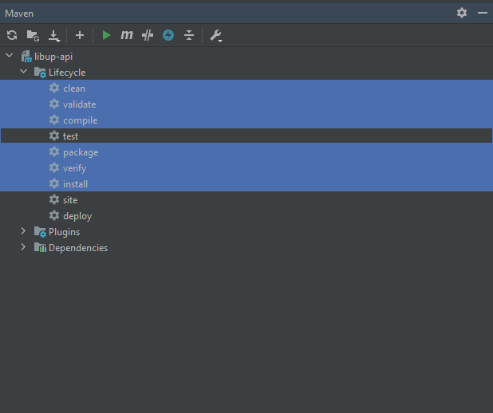

# LIBUP JAVA SPRING BOOT VERSION 2.1.6

### Variables de entorno
src/main/resources/application.properties

* spring.datasource.url -> Url de la base de datos.
* spring.datasource.username -> Usuario de la base de datos
* spring.datasource.password -> Contraseña de la base de datos
* Loggin with SMTP son los datos para el envio de correos.
* acr.accessKey -> access key de la plataforma acrcloud
* acr.accessSecret -> access secret de la plataforma acr cloud

### Variables de Firebase para notificaciones
/src/main/java/com/americadigital/libupapi/Utils/ConstantsTexts.java

* public static final String FIREBASE_KEY -> key de firebase
* public static final String FIREBASE_URL -> firebase url

### Requerimientos producción

* Tener instalado como minimo JAVA 8, y el SDK DE JAVA 8)
* Instalar Tomcat 8 o 9
* Crear las carpetas de imagenes y de audios dentro de webapps (los nombres de las carpetas estan en el archivo /src/main/java/com/americadigital/libupapi/Utils/ConstantsTexts.java) y tiene un comentario que dice //URL DE IMAGENES Y AUDIO
* La carpeta de webapps se encuentra en catalina.home dentro del servidor y depende de la instalación del tomcat.

### Instrucciones Local

* 1.- Clonar el proyecto
* 2.- Requisitos previos (tener instalado como minimo JAVA 8, y el SDK DE JAVA 8)
* 3.- Usar Intellij Comunity en su ultima version o cualquier IDE, que soporte Spring boot
* 4.- Una vez clonado, importar el proyecto y seleccionar Create project from existing source y presionar siguiente y seguir la instrucciones de la importación.
* 5.- Dentro del proyecto esta un archivo que se llama pom.xml, click derecho y presionar Add as maven (para importar las librerias)
* 6.- Realizar las configuraciones para hacer play (dirigirse a la pestaña Run/Edit Configurations, agregar la configuracion Application, asignarle un nombre seleccionar el working directory, que es la clase que contiene el main, definir el classplath of module, que es la carpeta principal y seleccionar el JRE en este caso es el 1.8).
* 7.- Guardar las configuraciones y presionar Play.

### Instrucciones para producción
* 1.- Dirigirse a la clase principal src/main/java/com/americadigital/libupapi/LibupApiApplication.java
* 2.- Poner la clase de esta forma public class LibupApiApplication  extends SpringBootServletInitializer
* 3.- Dirigirse a la pestaña Maven en Lifecycle seleccionar lo que se ve en la imagen y presionar el botón de play de encima. 
  
* 4.- Si el proceso fue satisfactorio se genera el war en la siguiente ruta /Libup-API-Java/target/libup-api-0.0.1-SNAPSHOT.war
* 5.- Subir el war generado a tomcat
* 6.- La url es el dominio mas el nombre del war ejemplo: http://161.22.41.216:8080/libup-api-0.0.1-SNAPSHOT/
* 7.- Eliminar SpringBootServletInitializer de la clase principal. 